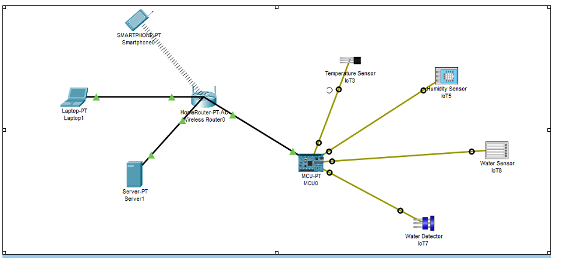
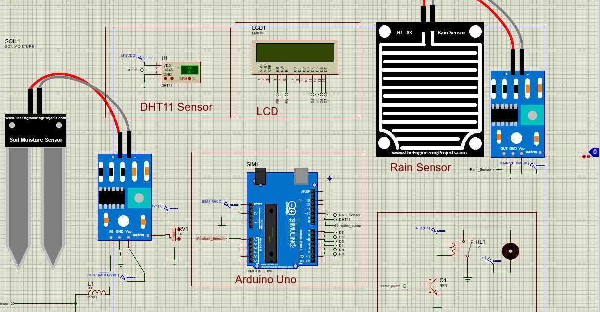
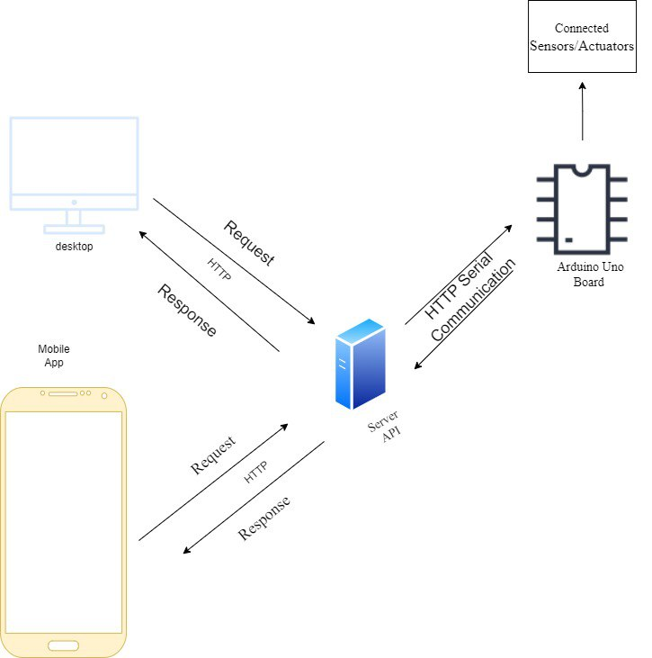

# IoT-Based Smart Agriculture to optimize water usage

In traditional agriculture, inefficient irrigation practices lead to water wastage and suboptimal crop yields, posing challenges for farmers striving for sustainability. This project aims to address these issues by introducing IoT technology to enhance irrigation practices. By deploying IoT field sensors and automated irrigation systems, farmers can optimize water usage and improve crop yields.

## Objective

The primary objective of this project is to introduce IoT into agriculture, focusing on enhancing irrigation practices. By deploying IoT device field sensors, implement automated irrigation systems, farmers can optimize water usage, thus improving crop yields. The potential advancement of the project is integrating IoT-enabled weather monitoring systems, leveraging real-time data collected by IoT sensors and analyzing it with machine learning algorithms, farmers aim to improve irrigation practices, reduce water wastage, enhance crop quality, and achieve sustainable agriculture practices. Additionally, utilizing smart sensors and drone technology enables early detection of pests and diseases, promoting sustainable farming practices and overall crop health.

### Materials and Methodologies

### IoT field sensors:

- **Temperature Sensor**: Monitoring temperature is crucial as it affects plant growth, development. (DHT11)

- **Humidity Sensor**: Humidity levels influence evaporation rates, soil moisture retention, and plant transpiration. (DHT11)

- **Moisture Sensor**: Soil moisture sensors provide real-time data on the water content of the soil, allowing for precise irrigation scheduling.

- **Rain Sensor**: Rain sensors detect rainfall and help adjust irrigation schedules accordingly.

- **Relay for Water Pump Control**: The relay serves as a switch to control the water pump based on data received from sensors.

### Programming Language:

- **Node.js with Express**: We use Node.js as runtime environment for our server-side code, while Express.js provides a framework for building robust API.
- **React.js**: We utilized React.js to develop the frontend web application, showcasing statistical sensor data.
- **Socket.IO**: Socket.IO is a JavaScript library that enables real-time, bidirectional communication between web clients and servers. we Integrated Socket.IO into our Express API to establish real-time communication between the microcontroller and server. Socket.IO allow us to emit events from the microcontroller to the server (e.g., sensor readings).
- **React Native**: We opted for React Native to craft the mobile application component of our project. Displaying essential data through mobile phones is crucial for providing users with convenient access to real-time information and enabling on-the-go decision-making. With React Native, we can leverage the platform's cross-platform capabilities to develop a mobile application that delivers critical data directly to users' smartphones.
- **C/C++**: we used C/C++ for the microcontroller code implementation.

## IOT system modeling

Here is a detailed model of our IoT system architecture, including components, communication protocols, data flow, and interactions between system elements using packet tracker.



## Micro controller design(architecture)

This project involves selecting appropriate microcontrollers, designing the hardware architecture. The focus is on creating efficient, reliable, and scalable microcontroller-based systems for diverse IoT applications, for smart agriculture.



- **Arduino Uno**: We use Arduino Uno emulator from proteus as microcontroller.
- **Soil Moisture Sensor**: This sensor detects the amount of moisture in the soil by measuring the electrical resistance. As the soil dries out, the resistance increases.
- **DHT11 Sensor**: This sensor measures humidity and temperature.
- **Rain Sensor**: This sensor detects the presence of rain by measuring the conductivity of water droplets on its surface.

- **LCD (Liquid Crystal Display)**: This display shows the readings from the sensors such as humidity, temperature, moisture and rain.

## System Architecture



## Installing the Project

Download the project from this repository with the following command and go in the project directory:

```bash
   git clone https://github.com/Abrish-seng/IoT-Based-Smart-Agriculture-to-optimize-water-usage.git
   cd IoT-Based-Smart-Agriculture-to-optimize-water-usage
```

## Proteus and Arduino Installation on Linux / Windows

Arduino is already included in the Proteus simulation software. However, Proteus does not natively support Linux. While you may be able to run Proteus through WINE, there is no guarantee that all features will work correctly. Proteus requires numerous libraries to simulate various microcontrollers, which can complicate compatibility with WINE.

For the best experience running Windows software without Linux ports, consider installing a Windows OS on a separate partition or as a virtual machine.

### Recommended Approach: Using a Virtual Machine

1. **Install a virtual machine**:
   - Use software like VirtualBox or VMWare on your Ubuntu OS.
2. **Set up a Windows OS**:
   - Install Windows inside your virtual machine.
3. **Install Proteus**:
   - Once Windows is set up, install Proteus within the virtual environment and start using it.

This approach ensures better compatibility and functionality for running Proteus on a Linux system.

[Download Proteus](https://www.labcenter.com/download/proteus/)

### After Installing Proteus then Run the Proteus Simulation Design

- Launch Proteus Software

### Running Arduino Code and Loading it into Proteus

To run Arduino code and load it into Proteus for simulation, follow these steps:

#### Step 1: Write and Compile Arduino Code

1. **Open Arduino IDE**:

   - Launch the Arduino IDE on your computer.

2. **Open the Arduino code**:

   - Open the Arduino sketch (Smart_Agriculture_System_Code.ino file) in the Arduino IDE.

3. **Compile the Code**:

   - Click the "Verify" button to compile your code.
   - Ensure there are no errors in the code. If there are errors, correct them and recompile.

4. **Locate the .hex File**:
   - Enable verbose output during compilation by going to `File -> Preferences` and checking the "Show verbose output during compilation" box.
   - Compile the sketch again. The output window will show the path to the generated .hex file. Note this path.

#### Step 2: Load the .hex File into Proteus

1. **Open Proteus**:

   - Launch the Proteus software on your system.

2. **Open a Project**:

   - Open the Proteus project file (Smart_Irrigation_System_Proteus_Simulation.pdsprj) by navigating to `File -> Open` and selecting the design file.

3. **Load the .hex File**:

   - Double-click on the Arduino board component to open its properties.
   - In the properties window, find the "Program File" section.
   - Click the folder icon next to the "Program File" field, then browse to and select the .hex file generated by the Arduino IDE.

4. **Configure the Simulation**:

   - Ensure all components are correctly connected in the design.
   - Verify that all necessary libraries and components are included in the Proteus project.

5. **Run the Simulation**:

   - Click the play button or go to `Simulation -> Run` to start the simulation.
   - Monitor the Arduino board and other components to ensure the code runs as expected.

6. **Analyze Results**:
   - Observe the behavior of the Arduino project within the simulation environment.
   - Make any necessary adjustments to the code or the Proteus design and re-run the simulation if required.

For detailed instructions and troubleshooting, refer to the Proteus documentation or support resources.

### Installing Node.js on Windows/Linux

Node.js is an open-source server environment with which we developed the backend and the logic for automated irrigation. The backend is the heart of the application, we use Node.js to develop the backend API.

#### On Windows:

1. **Download Node.js Installer**:

   - Go to the [Node.js download page](https://nodejs.org/).
   - Download the Windows installer (e.g., `.msi` file).

2. **Install Node.js**:

   - Run the installer and follow the setup steps, ensuring you install the recommended version and include npm (Node Package Manager).

3. **Verify Installation**:
   - Open Command Prompt and run:
   ```sh
   node -v
   npm -v
   ```

#### On Linux:

1. **Update Package List**:

   - Open a terminal and run:

   ```sh
   sudo apt update
   ```

2. **Install Node.js and npm**:

   - For Ubuntu/Debian-based systems:

   ```sh
   sudo apt install nodejs
   sudo apt install npm
   ```

   - For other Linux distributions, follow the specific installation instructions on the [Node.js download page](https://nodejs.org/).

3. **Verify Installation**:
   - Run the following commands in the terminal:
   ```sh
   node -v
   npm -v
   ```

By following these steps, you will have Node.js and npm installed on your Windows or Linux system, enabling you to develop and run your backend for automated irrigation.

### Installing API, Web App and Mobile App

#### Backend API

To install all dependencies for the backend API, run the following commands:

```bash
cd back-end-api
npm install

```

To run the API server

```bash
npm run dev

```

#### Frontend

To install all dependencies for the frontend, run the following commands:

```bash
cd web-app
npm install
```

To run the web app.

```bash
npm run dev

```

#### Mobile Platform (React Native)

To install all dependencies for the mobile platform, run the following command:

```bash
cd mobile-app
npm install
```

To run the mobile app.

```bash
npm start

```

### Author

**Abrish-seng**

- GitHub: [Abrahaley G/slassie](https://github.com/Abrish-seng)
- GitHub: [Kedir Abdurahman](https://github.com/keddo)
